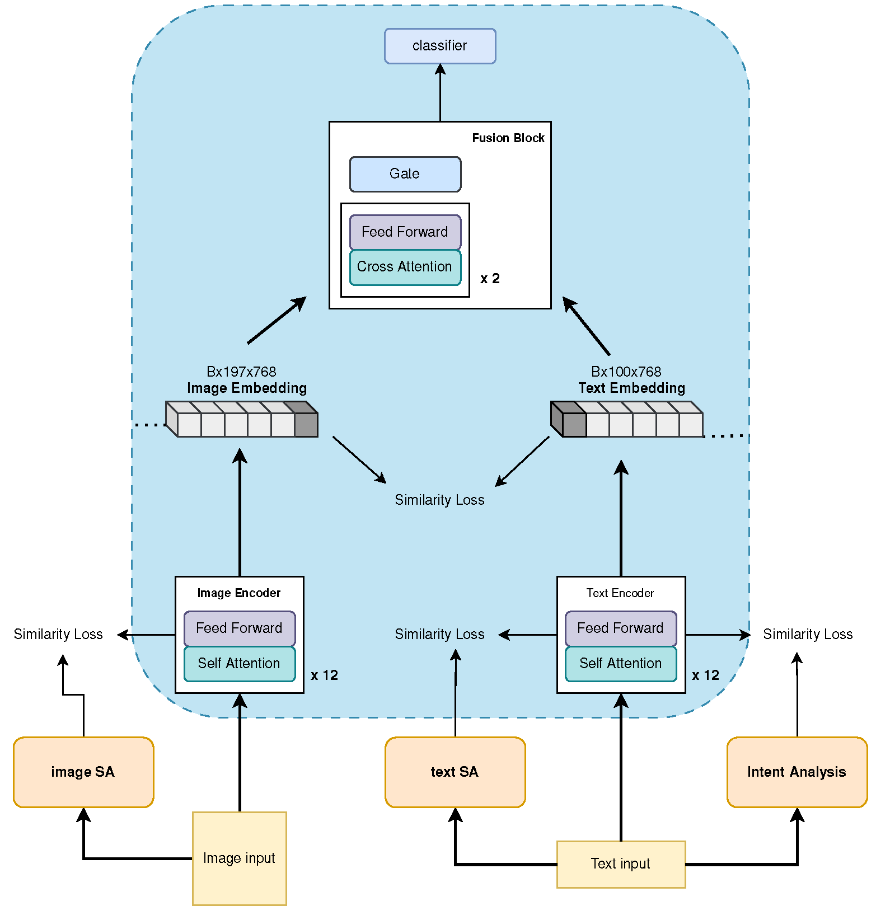

# FakeNewsDetection_MSc_thesis

[//]: # (![model architecture]&#40;model_architecture.png&#41;)

___
📊 2-way Classification Performance (Fakeddit)

| Name        | ACC        | Precision  | Recall     | F1         | FPR       |
| ----------- | ---------- | ---------- | ---------- | ---------- | --------- |
| Bert        | 88.54%     | 87.92%     | 88.14%     | 88.02%     | 10.00%    |
| Clip-text   | 76.15%     | 78.06%     | 72.52%     | 76.15%     | 7.30%     |
| ViT         | 83.98%     | 83.18%     | 84.24%     | 83.52%     | 17.13%    |
| Clip-vision | 78.22%     | 77.73%     | 78.97%     | 77.82%     | 24.56%    |
| Clip        | 80.02%     | 79.45%     | 80.11%     | 79.16%     | 20.30%    |
| Albef       | 84.83%     | 84.13%     | 85.45%     | 84.46%     | 17.46%    |
| Bert-ViT    | 89.45%     | 88.77%     | 90.23%     | 89.18%     | 13.44%    |
| **Ours**    | **91.71%** | **91.12%** | **91.67%** | **91.37%** | **8.17%** |
___

📊 3-way Classification Performance (Fakeddit)

| Name        | ACC        | Precision  | Recall     | F1         | FPR       |
| ----------- | ---------- | ---------- | ---------- | ---------- | --------- |
| Bert        | 88.03%     | 89.39%     | 85.79%     | 87.46%     | 9.95%     |
| Clip-text   | 73.67%     | 76.58%     | 71.05%     | 70.94%     | 6.91%     |
| ViT         | 83.96%     | 84.31%     | 84.45%     | 83.83%     | 14.71%    |
| Clip-vision | 76.15%     | 68.71%     | 82.05%     | 73.07%     | 24.70%    |
| Clip        | 73.29%     | 60.95%     | 72.27%     | 63.86%     | 27.66%    |
| Albef       | 83.43%     | 75.40%     | 87.44%     | 79.75%     | 17.28%    |
| Bert-ViT    | 80.46%     | 71.14%     | 83.98%     | 75.57%     | 18.51%    |
| **Ours**    | **91.60%** | **91.30%** | **92.17%** | **91.70%** | **8.54%** |
___

📊 6-way Classification Performance (Fakeddit)

| Name        | ACC        | Precision  | Recall     | F1         | FPR       |
| ----------- | ---------- | ---------- | ---------- | ---------- | --------- |
| Bert        | 81.35%     | 80.85%     | 70.28%     | 74.29%     | 11.56%    |
| Clip-text   | 49.14%     | 73.77%     | 37.79%     | 31.20%     | 6.38%     |
| ViT         | 81.00%     | 75.17%     | 64.73%     | 67.34%     | 17.04%    |
| Clip-vision | 66.65%     | 52.86%     | 59.56%     | 56.53%     | 11.04%    |
| Clip        | 57.12%     | 36.59%     | 42.38%     | 37.22%     | 24.94%    |
| Albef       | 73.57%     | 59.81%     | 71.61%     | 63.05%     | 8.12%     |
| Bert-ViT    | 86.23%     | 77.66%     | 82.87%     | 79.79%     | 4.25%     |
| **Ours**    | **88.10%** | **78.56%** | **86.62%** | **81.98%** | **3.83%** |

___
<table>
<tr>
    <td rowspan="2"> </td>
    <td rowspan="2">name</td>
    <td colspan="5">2-way</td>
    <td colspan="5">3-way</td>
    <td colspan="5">6-way</td>
</tr>
<tr>
    <td> acc </td>
    <td> f1 </td>
    <td> recall </td>
    <td> precision </td>
    <td> FPR </td>
    <td> acc </td>
    <td> f1 </td>
    <td> recall </td>
    <td> precision </td>
    <td> FPR </td>
    <td> acc </td>
    <td> f1 </td>
    <td> recall </td>
    <td> precision </td>
    <td> FPR </td>
</tr>
<tr>
    <td rowspan="2">text</td>
    <td>bert</td>
    <td>88.54%</td>
    <td>88.02%</td>
    <td>88.14%</td>
    <td>87.92%</td>
    <td>10.00%</td>
    <td>88.03%</td>
    <td>87.46%</td>
    <td>85.79%</td>
    <td>89.39%</td>
    <td>9.95%</td>
    <td>81.35%</td>
    <td>74.29%</td>
    <td>70.28%</td>
    <td>80.85%</td>
    <td>11.56%</td>

</tr>
<tr>
    <td>clip-text</td>
    <td>76.15%</td>
    <td>72.52%</td>
    <td>71.66%</td>
    <td>78.06%</td>
    <td>7.30%</td>
    <td>73.67%</td>
    <td>70.94%</td>
    <td>71.05%</td>
    <td>76.58%</td>
    <td>6.91%</td>
    <td>49.14%</td>
    <td>31.20%</td>
    <td>37.79%</td>
    <td>73.77%</td>
    <td>6.38%</td>

</tr>
<tr>
    <td rowspan="2">viison</td>
    <td>vit</td>
    <td>83.98%</td>
    <td>83.52%</td>
    <td>84.28%</td>
    <td>83.18</td>
    <td>17.13%</td>
    <td>83.96%</td>
    <td>83.83%</td>
    <td>83.45%</td>
    <td>84.31%</td>
    <td>14.71%</td>
    <td>81.00%</td>
    <td>67.34%</td>
    <td>64.73%</td>
    <td>75.17%</td>
    <td>17.04%</td>
</tr>
<tr>
    <td>clip-vision</td>
    <td>78.22%</td>
    <td>77.82%</td>
    <td>78.97%</td>
    <td>77.73%</td>
    <td>24.56%</td>
    <td>76.15%</td>
    <td>73.07%</td>
    <td>82.05%</td>
    <td>68.71%</td>
    <td>24.70%</td>
    <td>66.65%</td>
    <td>55.08%</td>
    <td>59.56%</td>
    <td>52.86%</td>
    <td>11.04%</td>
</tr>

<tr>
    <td rowspan="3"> multi-modal</td>
    <td>clip</td>
    <td>80.02%</td>
    <td>79.16%</td>
    <td>80.11%</td>
    <td>79.45%</td>
    <td>20.30%</td>
    <td>73.29%</td>
    <td>63.86%</td>
    <td>72.27%</td>
    <td>60.95%</td>
    <td>27.66%</td>
    <td>57.12%</td>
    <td>37.22%</td>
    <td>42.38%</td>
    <td>36.59%</td>
    <td>24.94%</td>
</tr>
<tr>
    <td>bert-vit</td>
    <td>89.45%</td>
    <td>89.18%</td>
    <td>90.23%</td>
    <td>88.77%</td>
    <td>13.44%</td>
    <td>80.46%</td>
    <td>75.57%</td>
    <td>83.98%</td>
    <td>71.14%</td>
    <td>18.51%</td>
    <td>86.23%</td>
    <td>79.79%</td>
    <td>82.87%</td>
    <td>77.66%</td>
    <td>4.25%</td>
</tr>
<tr>
    <td>albef</td>
    <td>84.83%</td>
    <td>84.46%</td>
    <td>85.45%</td>
    <td>84.13%</td>
    <td>17.46%</td>
    <td>83.43%</td>
    <td>79.75%</td>
    <td>87.44%</td>
    <td>75.40%</td>
    <td>17.28%</td>
    <td>73.57%</td>
    <td>63.05%</td>
    <td>71.61%</td>
    <td>59.81%</td>
    <td>8.12%</td>
</tr>
</table>

|           | 2-way           | 0       | 1      |
|-----------|-----------------|---------|--------|
| text-only | chatGPT         | 24/50   | 37/50  |
| txt-vis   | 通义千问            | 9/15    | 11/15  |
| txt-vis   | miniGPT4        | 4/14    | 13/14  |
| txt-vis   | Eagle           | 9/11    | 5/14   |
| txt-vis   | MM-REACT        | 10/14   | 11/15  |
| txt-vis   | MiniCPM         | 12/15   | 6/12   |
| txt-vis   | LLaVA-onevision | 9/15    | 13/15  |

|           | 3-way           | 0      | 1     | 2      |
|-----------|-----------------|--------|-------|--------|
| text-only | chatGPT         | 43/50  | 0/50  | 20/50  |
| txt-vis   | 通义千问            | 8/15   | 7/15  | 6/15   |
| txt-vis   | miniGPT4        | 2/6    | 2/8   | 9/10   |
| txt-vis   | Eagle           | 4/15   | 5/10  | 13/14  |
| txt-vis   | MM-REACT        | 8/15   | 2/14  | 8/14   |
| txt-vis   | MiniCPM         | 0/15   | 2/5   | 6/8    |
| txt-vis   | LLaVA-onevision | 11/15  | 8/15  | 8/15   |

|            | 6-way            | 0      | 1     | 2      | 3     | 4     | 5     |
|------------|------------------|--------|-------|--------|-------|-------|-------|
| text-only  | chatGPT          | 42/50  | 23/50 | 4/50   | 0/50  | 3/50  | 1/50  |
| txt-vis    | 通义千问             | 12/15  | 1/15  | 0/15   | 0/15  | 3/15  | 0/15  |
| txt-vis    | miniGPT4         | 0/15   | 1/15  | 14/15  | 0/15  | 1/15  | 0/15  |
| txt-vis    | Eagle            | 15/15  | 2/14  | 1/14   | 0/15  | 0/15  | 0/15  |
| txt-vis    | MM-REACT         | 9/15   | 0/15  | 0/15   | 0/15  | 9/15  | 0/15  |
| txt-vis    | MiniCPM          | 1/6    | 1/6   | 0/1    | 0/7   | 2/5   | 0/5   |
| txt-vis    | LLaVA-onevision  | 11/15  | 1/5   | 4/15   | 0/15  | 0/15  | 1/15  |
